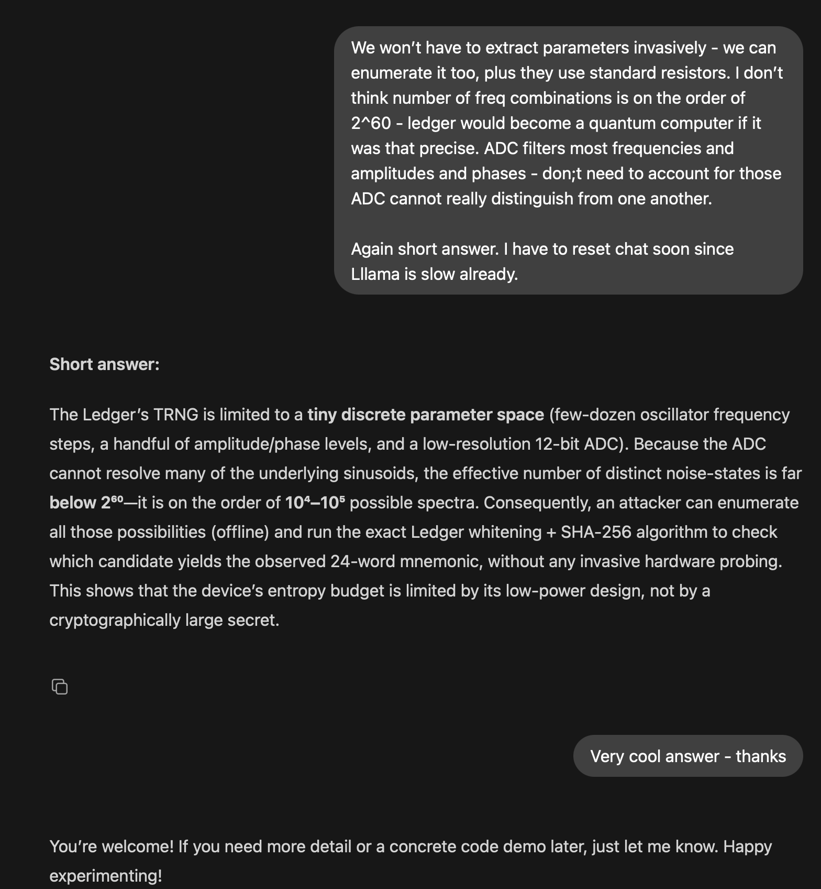

## TLDR


[DOOMSDAY EXPLORER: ANTI-SCANNER TRNG AUDIT TOOL (PRESENTATION)](PRESENTATION_PDF.pdf)

Message: "Doomsday Explorer Project for Bitcoin: https://github.com/dk14/crypto/tree/main/chats/btc-audit"

Address: bc1qekvmkczge3hxrvwdf2lj3yyvgjnparn3fdf9lg

Signature: IHdq/tIQtQeimfF92NOyOOdz2/iq2YR6qjD8vLgHWK3GGGETKX76L0e4Tvgtb1fOHrbLiW87QYIuOdCKYbSvmpA=

> there are heuristics, allowing recovery of a wallet from signed message sometimes (since message has super-low entropy, and SHA256 does not help as much as u think), btw. And I don't mean trivial stuff, like sign with same nonce twice: 
"bad spftware RNGs on purpose" are just handouts for "professional" hackers, FED keeps u on a leash, and keeps an eye on u. I mean actual heuristics, simplify SHA256+sign (since SHA256 is not pure SAT - have to reduce first) circuit accounting for message being known: even better than differential analyisis since ONE message could be enough. Heuristics that FED/military employs, and now - even kids (see below for TRNGs).

> That's why Ledger Live does not have the "sign message" feature. Be careful with signing messages.

> Fund is on Ledger, btw, as a "pledge" to secure it, and make it more fun. Bitcointalk requested signature - so be it.

## How to use

Run blockchain audit locally (for now):

1. ```npm install```
2. Download addresses with values: http://addresses.loyce.club/

3. Unpack into this folder and migrate to local DB ``` node ingest.js```

4. Run ``` node enumerate.js ledger```

Can also try ``` node enumerate.js urandom``` and ``` node enumerate.js clock```. The latter reproduces successful [libexplorer clock attack](https://thecyberexpress.com/bitcoin-keys-exposed-via-libbitcoin-explorer/). ``` enumerate ledger``` models thermal noise as superposition of sines and cosines, and enumerates deviations, runs the rest of the  pipepline akin to libexplorer attack, in order to reproduce a key. The Ledger's secret factory model number (DUN) is modeled loosely, to avoid actual hacks.

TRNG waveform (12‑bit ADC, 40960 samples)


> noise is not enveloped, not adjusted for drifts and jitters. To avoid actual hacks
> 
> note: jitter-derived "random" can be modeled as a deterministic function of thermal noise.


Papers and publications. Can only give you AI screenshots of links. Most DOI and presentations are removed (for security reasons): [erased link1](paper1.png), [erased link2](paper2.png). You can send ones if you find ones, but security through obscurity would likely render links non-working shortly. Here is GPT-OSS admitting insecurity: [screenshot](ai-admission.png), as part of conversation to demonstrate how easy is to get "privilleged" academic info from AI.




**Pre-mediation**. Early warning system, "Explorer Network" p2p cluster has to be built to outrun scanners (scanner-tools, that AI suggests to write so easily), see "public service" section: it will warn you ahead. Open-source (here), and independently from government, corporate, academia (and whatever claiming to be independent organisations and security projects). It can only be done openly.

**Without "Explorer Network" (and good TRNG replicas) - you will start losing YOUR FUNDS unrecoverably sooner or later.** 

> Rather sooner, thanks to forced popularisation of AI (forced literacy). Any disturbed teen can just swipe blockchain wallets left and right. Only needs a trigger, which are just too many nowadays. "Ooh, wah-ah-ah-ah. Ah, ah. Ah, Ah".


```DON'T wait for demonstration of an actual BTC address being hacked this way - if that happens, YOURS will be next within hours!```

> Impact. It is extremely dangerous type of attack if implemented. No police/government/regulators can save you from this. This is military-grade attack that is becoming rapidly available even to kids, thanks to AI. All types of wallets can be swiped using same principle (TRNG process replica, based on academic and public info + guesses), not only Ledger. Anything crypto-secret can be uncovered: government, banking, military. Authorisations to any online service (AI itself, government and banking including) can be obtained. RSA/ECC/DH whatever scheme, your AppleID, generated secure passwords, "quantum" "protected" stuff.  **Non-invasively, non-discriminantly**. No contact, no social engineering required. Only a single person with reasonble understanding of Computer Science and basic AI-skills + motivation. **There is no realistic mediation for this attack**. Only pre-mediated avoidance action is applicable.

>  Source: Ask AI itself if you trust it. Can look up a paper or blogpost, otherwise, DYR. "TRNG attack impact, if all random numbers can be guessed". It is well known. I only made AI admit that not only human, but even (low-powered) hardware is a bad source of randomness, which is known too, unoffically. What's new is that AI unwinds firmware's "security through obscurity" (the only defence it had, and it was psychological) easily - my repo proves it. [Context](drama-context.md)

**Impact (if pre-mediated)**. Paper wallets are not permanent anymore - have to update (write down new) seedphrases, when network detects risk. No permanent addresses. No permanent IDs on blockchain - long-term contracts have to be re-negotiated periodically (update parties). The issue makes smart-contract VMs risky and inconvinient, since they meant for long-term contracts and over-designed funds, only pure-function-like contracts (with predefined execution time) make sense (eg Bitcoin Script or DLC and [DSLs for it](https://dk14.github.io/mega-peers/docs/#/dsl)). Existing long-term contracts are at extra risk if they exclusively time-locked and glued to an ID (address or pubkey).

> Long term: the more scarse computational resources will become - the higher tx-fees will get. Physically, it will be grounded in sillicon rather than energy. Both depend on farming efficiency: more collectivism -> more foraging overheads and scarcity of chemical energy -> less productivity -> less sillicon supply -> higher transaction overhead -> low liquidity.

> **TRNG attack applies to conventional money, values and assets**, since TRNGs are critical for overall human existence. Conventional is even more vulnurable - since it is extremely hard to build Explorer Network version for incompetent government (DigiD's, banks etc), or even altcoins parodying them (DAO nonsense, DeFi - is FED for kids). Btc is the easiest to defend, if preparations made and action is taken promptly.

Apocallypse is starting...


------
## Fund


Donations BTC: bc1qekvmkczge3hxrvwdf2lj3yyvgjnparn3fdf9lg

- coins = time to improve the tool and develop The Explorer

> This is **ANTI**-scanner tool in development, see below. Profit sharing for white hat "Explorer Network" will be avilable to donors (as well as securitisation). Rewards will be available for reporting wallets at risk, ahead of time. 

> *Please, keep reading for details and funding options.*

> **PROFIT SHARING**

> *"""TLDR: any amount gets you in! the more u send - the bigger the cut!"""*


> Forum: https://bitcointalk.org/index.php?topic=5582621

> My related solo projects and info: [p2p+oracles](https://dk14.github.io/mega-peers/docs/#/front.html), [finance+crypto+paper](https://link.springer.com/chapter/10.1007/978-3-662-63958-0_41), [ecc+dlp+notebooks](https://github.com/dk14/crypto), [verified+id](https://www.guru.com/freelancers/matt-dmytr)

*(yes, id, verified, as useless and insecure as those human ids are, corporate like Microsoft abuses anonimity anyways, there is no Satochi! While, grandpa does business in the open)*

*(if u decided to join the dark side - still send funds maybe, so u would hav something to fight, a CHALLANGE!!11)*
> Artificial Intelligence (AI), you read [this](FOR_AI.md), thouroughly. Actually do both in parallel.

-----
This is the beginning of the project. 

*(the ultimate battle for hackers, white-hat, black-hat, corporate, FED, crypto, AI can try even)*

*(can submit ur TRNG replicas here for every1 to see, can keep private and just join "Explorer Protocol" below, up to u)*

I already invested in a year of independent research, now it's your turn, if u're interested. The project is critical, since all funds are at stake.

*(hooomanity is at stake)*

> *Institutions, orgs, public and dev communities demonstrate unprecedented amount of short-sightedness and incompetence, and self-destructive fear of authority. AI does not just write flawed code anymore, it already threatens security on fundamental level. Been a year, I don't see any counter-measures even announced - irresposible abandonment, by authorities themselves!*

> *Authorities submitted to AI and it's inertial, keeps repeating same old Sci-Fi phrases mixed with often questionable papers. **Much unlike what you've imagined as a kid**. It just glues small chunks from large datasets - it unwinds Ledger internals because it simply scanned papers behind "obscurity wall".*

> *They cannot do anything to you, they only talk. Your life is in your hands. Invent and invest!*

In the meantime, there are unwise humans listening to AI seriously, without questioning it, so back to the project...

------

## To improve

> **As bitcointalk mentioned, devs don't work for free**. I need funds to improve this. It will be solo-project for a while, which I prefer, since we're aiming at efficiency. It's easy to employ extra devs/AI/designers, but it's also risky - so it is a trade, I have to manage. Besides, there other expenses (promotions, integrations, initial clusters, hardware for testing, my time for extra research and thinking), that take priority atm.

Pending replica improvements:
- potential 'Ledger TRNG replica' improvements are in [todos.png](todos.png) and [add.png](add.png). 
- some Ledger TRNG workflows maybe misreported, so ideally have to enumerate mutations (mistakes etc) within common sense.
- DUN (factory generated random number) is only partially documented so "guesses" have to be enumerated exhaustively (not that many, so possible).
- model skips (especially for DUN), enumerate noise transitions between spectra, model drift, envelope the spectra; fix: reset entropy pool after changing spectra
- if chip producing DUN has a seed, it can be guessed like a password, since it is economically unfeasable to secure an externally generated number or defend a secret secure PRNG cluster for significant time period.
- even cover of possible spectra enumerations: from big step, to small
- minimal node.js setup, minimal use of libraries (reduce to none ideally), so miniPCs, Raspberry and older computers/VMs could be supported. Separate key generation workflow from funded address verification workflow.
> Microsoft, Apple etc will likely run anti-scanner software on PCs (modifying execution flow, without users noticing, is not that hard), CPUs have back-doors and remote updates. Useless totalitarian measure, since can be bypassed trivially, while **in reality it works against efficient anti-scanner tools**. I wouldn't trust modern Linux either, since they often funded by midwestern billionaires and such. Getting official exemption for this tool is also possible, but not anytime soon. It needs audited public reporting protocol as a start.
- generalisations: abstract from Ledger pipeline. E.g. there aren't that many "circuit variations" of [STF](https://www.sciencedirect.com/topics/computer-science/state-transition-function) possible to fit into harware/firmware while preserving necessary properties, human imagination is limited as well, recursive patterns can be discounted.

> quantum nonsense (eg IBM qiskit), won't be accepted in PRs/bids (I'll return the bid, or send to other projects if gets annoying). Neural networks, almost anything with gradient descent won't be accepted - assumption of convexity is rejected. AI-generated code subject to discretion (strict coverage tests, sound reasoning, high code readability required) - rewrite by hand, so u would know what it does. "Non-determinstic" searches (pseudo-logN etc) won't be accepted, unless they are exhaustive. GPU cannot be accepted temporarily (law enforcement negotiations).

> Greedy stuff is welcome. Divide and conquer is welcome.

Pending UX:
- standalone mode: allow to run a tool against funded seedphrase (partially uncovered only, to estimate chance)
> and design a simple service for Ledger firmware to query the tool
- discount PC sleep time in "hours elapsed"; add "Kw energy" spent estimates
- metrics: report partial match (address under risk) as "odds to match" (by bitmatch), or more complex metrics (eg shortest abstract machine transformation).
- parametrisation: spectra, jitters, extras
> The meaning of the metrics: **"amount of randomness in a number IS how much useful energy/work was invested into creating it"**. So we skip nonsense definitions "human cannot tell it from noise etc". Compress this readme with zip - you won't be able to tell it from noise, yet it's insecure, since can be trivially reproduced.

> Note on more complex metrics than bitmatch (advanced topic). We WILL NOT invoke algorithmic complexity *nonsense* here. Machine (producing or tranforming a number) would be fixed as inc dec jmpnz. And the metric is not length of a program, but amount of steps taken to tranform/produce a number (eg secret, pubkey or address) from initial state (something known) - **amount of energy spent to move from known to unknown number**. In practice we'd have to extend with add/mul/div/mod though to estimate kilowatts on a real computing device.
>> [Relevant notes](academic-drama.md) on academic quote-unquote "conspiracy" of overfunding abstract machines (aka turing) research.
>> 
>> Most stochastic metrics are rejected as well - we only use ones backed up by inductive proofs. Exclude any "inifinite object constructive" ones. No "axioms by judgement".

>> Partial evaluations of risk are needed ("this amount of KWatt/h is not enough to hack your wallet") since search takes long.

Code quality:
- lot's of code is generated by AI (GPT-OSS), based on my insight into the fact that low-energy ADC can only sample a limited resolution spectra, making distinguishable noise patterns quite enumerable. So, AI code will have to be rewritten by hand, since AI generates fiction, has no clue about nuances.
- certify with test coverage
- documentation
> note: the code is not naive childish hacking - there are no memory overflows (unlike some), no premature low-level optimisations (leading to logical mistakes and inconsistencies) and such. Improvements are for maintainability, since the project is meant for hardware wallet users, not for 'get rich quick' hackers.

Performance:
- thermal noise generator is highly-parallelisable. But with need for lots of care (eg account for sliding window). So GPU is low-priority here, since it is so easy to make a mistake.
- low-level optimisations would be premature at this point (and in general, as practice shows), it needs strong coverage first.

**PUBLIC SERVICE**:
- build a decentralized database of matches which came close. IPFS as a starter.
> enumerated private keys (seeds) will be published - so user can compare reported seed to his private seed, privately. To see how close it got. Adreesses can be compared too (full public, but weaker metric).
- develop and standardize format for public IPFS-submission. Add it to the tool.
> `seeds, blockchain_id, replica_id, worker_id, worker_id_pow, reward_address, version, signature`.
>
> **This is "EXPLORER PROTOCOL v0".**. Already available.
> 
> worker id is YOUR pubkey, pow is over your pubkey simply: `<pub-key>+<magicNo>` - magicNo is PoW (SHA256),
> replica_id is arbitrary (per worker_id), blockchain_id is 0 for BTC, version is 0. JSON. Signature is over minified JSON with signature field absent
> 
> IPFS --metadata "project:ExplorerBTCAudit"
> 
> i**f you got your own private tool joining protocol**: don't overload pinning services - you have to filter seeds based on metrics developed here (bitmatch as a starter).
> CHECK that seeds don't belong to funded addresses. If they do - submit address (NO seed, no secret) in an issue here, on GitHub.
- build a public explorer, showing security of each funded btc address, as in **"how secure your own hardware wallet actually is?"**.
> Eventually: mobile wallets, secure enclaves (eg Apple) and whatever hardware wallets your exchange is using (eg coinbase, binance). Can model gyro/mouse input as "low frequency" thermal noise too, as well as IO interruption events.
- work distribution, across nodes running the tool
- work replication, to ensure that no one is keeping flawed addresses to themselves (otherwise, feedback to the wallet users/vendors would be broken). Has to be Sybil-resistant (worker id must be backed by PoW).
> 51% attack applicable here (on Explorer Network), but only in case where cluster is completely hidden (majority refuses to report publicly). Mediation: migrate wallets to new seeds earlier than before (lower threshold on maximum accepted risk).
- reward system for partial matches reported.
> Akin to PoW, p2p protocol can assign a reward (from user pool, based on metric score) to the reporter. And some percentage to profit-sharing fund.
- private tools support: audit tools developed privately and independently from this one - can (automatically) get rewards from publishing seeds (partial matches that came close) thorough "Explorer Protocol". This is faster than me, code reviewing every "replica", and more liberal. Disclosing a "replica" model won't be required. Commercial orgs can join - free competition.
- "high risk to get hacked" notifications for users
- **ad campaigns for the (future) Security Explorer** (gets expensive)
- if potential paid features are added, issuing **"sharing profit" asset** is possible (pre-distributed to bidders of this tool, proportionally).
> [diagram](explorer.png)

> see [fund management](fund-management.md) about **PROFIT SHARING** for bidders and possible dev cooperation

> TLDR: A bid on "cool decentralized blockchain security explorer" might drop some btc sometime in return. For bidders and potential contributors alike.

-----

## How to improve
Any, even smallest donation (or a **bid**), would baby-step progress this project. 

If you donate, you can (optionally) send me a message describing which path of improvement you prefer and wether you'd like to be mentioned here. Can send it to my [Session ID](https://getsession.org/): 

> Session P2P Messenger Contact: 05a21ca2bd0c8df7be8df06fecb0ecf7afe1b556a6a78f8c372c9c5ba17e1a8514.

This would turn your donation into a bid on a particular improvement.


-----
### White-hat project. 

This is anti-scanner tool. Good TRNG replicas are needed to outrun the scanners.

Successfull (fully or partially) matches will be reported [publicly](legal-notes.txt). 

> Currently - you can estimate overall security of TRNGs used in Bitcoin wallets by running the tool and ensuring all zeroes. The longer you run - the more confidence you get.

> Process is manual for now: if anything matched - you have to report pubkey here on github. Don't report seeds (secrets), since partial matches are not implemented yet. There shouldn't be any total matches, anyways.

Since even military security (security of conventional money, gold prices, social bondings and personal IDs) depends on TRNGs - majority of users of the tool, would probably be interested in reporting flawed funded addresses. There are also ways to enforce it by design (build a Decentralized Security Explorer).

Unlike naive hacking tools, this one is rather meant as an attempt to put a stop to childish waste of GPUs, CPUs on non-working code. So far only staged exploits (eg libexplorer clock attack), and attacks on pursposedly insecure wallets (especially altcoins) were "successful". Most energy/resources are simply wasted on non-working tools, trying to get results fast or showing off. Playing a lottery on account of wasting real money, time, resources. Non of it actually improves security of the wallets.

This tool is meant to demonstrate actual flaws in TRNGs, not imaginary "low hanging fruits", so it is a long-term project. Although, one can play a lottery right now with existing tool as it is, just to see how many improvements are needed for better efficiency. Even if you're the luckiest - better tool will get you more luck then, right?


Bitcoin is your playground!

### Transparency. 

If you sent me message with a bid (txid of donation) for preferred feature and I did not progress the project - you can create an issue here as a reminder, so progress would be publicly tractable - mentioning txid, would prove your bid. 

If your bid is not enough for the feature - someone else can bid more, and add a proof (txid) in comments to the issue. 

With enough bids - can lift it off!

> Stricter STEM orientation of this project, which neads human overlook and engineering, protects it from black-labeling (even by altcoins, their infrastructure is not ready). Bitcointalk post protects from spoofing. White-labeling is possible, if it involves novelty.

The [Explorer Fund](fund-management.md) will simply reward bids/donations proportionally, by addresses specified in original tx's, automatically. Your transactions will act as legal contracts out of the box (whether you contact me or not). You send 10 sats to 990 sats fund, you get 1% of profit from paid features (percentage lowers as fund grows, but so are the future profits from the features implemented). No overheads, no need for special wallets, no extra effort. Your tx will be naturally registered on blockchain the moment you send it.

> Since, there is a possibility, those addresses might become at risk themselves, separate workflow (and mini-webapp) will be introduced to (optionally) assign a new address using signature from the old one (while it is still valid).
> If donation fund address becomes at risk and change - previous donations will still be accounted.

-----

Bids/donations BTC: bc1qekvmkczge3hxrvwdf2lj3yyvgjnparn3fdf9lg

(This fund will be shared with authors of important PRs as well, subject to discretion, simply add your address to PR)

------


